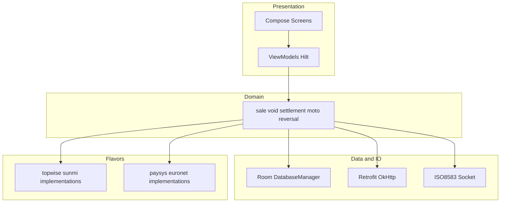
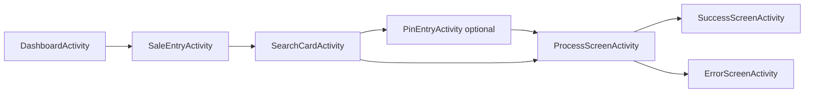

# Loop NextGen POS — Android Payment Terminal Application

**Portfolio / work showcase.** This document describes **Loop NextGen POS** — a production-style Kotlin Android payment terminal application. **Application source is not in this repository**; file paths are reference-only and point at the private codebase layout.

**Author:** [shummasniazi](https://github.com/shummasniazi)

A copy of this document is also kept as `readme.md` in the private development repository for editing; [fintech](https://github.com/shummasniazi/fintech) uses it as the default GitHub **README**.

---

## Tech stack

- **Language:** Kotlin  
- **UI:** Jetpack Compose, Material 3  
- **DI:** Hilt (Dagger)  
- **Persistence:** Room  
- **HTTP:** Retrofit, OkHttp  
- **Payments:** ISO 8583 over **raw TCP sockets**  
- **Hardware:** EMV / contactless on **Topwise** and **Sunmi** device flavors  
- **Integrations:** TMS (configuration), transaction logger API, DMS (discount), **JSch SFTP** for offline file upload  
- **Quality:** Detekt, Spotless (ktlint), SonarQube wiring in Gradle  

---

## Highlights

- **32 Gradle build variants** from four flavor dimensions (client × device × host × environment).
- **Dual acquirer host** support (Paysys / Euronet) with shared domain logic and host-specific source sets.
- **Dual terminal platform** integration (Topwise vs Sunmi) behind shared interfaces.
- **Full transaction lifecycle:** sale, void, settlement, reversal, MOTO, tip adjust, retail / billing flows.
- **TMS-driven** feature flags, merchant/network settings, and app update policy.
- **Transaction logger:** REST upload with **AES-encrypted line fallback** to local files, **SFTP** upload during settlement, **1000 records per part file** rollover.
- **DMS (discount):** API update with **CSV fallback** and same SFTP pipeline as discount files.
- **Operational resilience:** free-space guard before starting payment flows (internal data partition + app external files); dashboard dialog + SDK failure path.
- **Embeddable SDK** mode (`SDK_BUILD` / `isSdkBuild` in Gradle) exposing pay, keyed-in pay, void, settle, print, configure, settings, logon, transaction history.
- **Crash reporting** to encrypted external logs with **internal storage fallback** if external write fails.

---

## Architecture

**Pattern:** MVVM with `MutableStateFlow` / `StateFlow` for UI state; **Intent-based** navigation between Activities (no Jetpack Navigation graph).

**Layers (conceptual):**



**Typical sale UI flow:**



**Key directories** (in the full source repo):

- `app/src/main/java/.../presentation/features/` — one folder per screen (dashboard, sale, void, process, success, DMS, settings, etc.).
- `app/src/main/java/.../domain/transactions/` — sale, void, settlement, reversal, moto orchestration.
- `app/src/main/java/.../services/` — database, navigation, TMS, file logging, ISO helpers.
- `app/src/main/java/.../remote/network` — Retrofit APIs and repositories.
- `app/src/main/java/.../remote/socket` — binary ISO 8583 over TCP.
- `app/src/topwise/`, `app/src/sunmi/`, `app/src/paysys/`, `app/src/euronet/`, `app/src/uat/` — flavor-specific implementations.
- `app/src/main/java/.../sdk/` — host-app SDK surface (`SdkManager`, `SdkManagerImp`, callbacks, response shaping).

---

## Build variants (32 combinations)

Defined in `app/build.gradle.kts` under `productFlavors` and `flavorDimensions`:

- **Client:** `keenu`, `loop` — branding and client-specific resources.
- **Device:** `topwise`, `sunmi` — card reader, printer, EMV integration.
- **Host:** `paysys`, `euronet` — acquirer protocol and host-specific modules.
- **Environment:** `prod`, `uat`, `qa`, `dev` — encrypted config URLs and environment labels in `BuildConfig`.

**Example assemble task:** `:app:assembleLoopSunmiPaysysDevDebug`  
Produces a debug APK under `app/build/outputs/apk/<variantFolder>/debug/` (output naming may include version and variant in the filename).

**SDK vs app:** At the top of `app/build.gradle.kts`, `isSdkBuild` toggles between **standalone application** and **library-style SDK** packaging; `BuildConfig.SDK_BUILD` reflects the same for runtime branching.

---

## Core flows (reference paths)

Paths are relative to the **application module root** `app/`.

### Sale

- Orchestration: `src/main/java/.../domain/transactions/sale/ProcessSaleTransaction.kt`
- Host response, receipt, logger handoff: `.../domain/transactions/sale/CompleteSaleTransaction.kt`
- In-memory ISO and connection state: `.../domain/transactions/sale/handlers/TransactionHandler.kt`

### Settlement

- Batch selection, printing, SFTP for discount + logger fallbacks: `.../domain/transactions/settlement/helpers/SettlementHelper.kt`

### Transaction logger and SFTP fallback

- API send, timeout, fallback write: `.../remote/network/repositories/DataLoggerRepository.kt`
- Encrypted fallback append, DMS CSV append, JSch upload, archive: `.../services/fileLoggingService/FileLoggingService.kt`
- Constants (e.g. `MAX_RECORDS_PER_FILE = 1000`, folder names): `.../services/fileLoggingService/FileLoggingServiceConstants.kt`
- Deep dive: `docs/TransactionLogging.md`

### DMS (discount)

- Update discount API and CSV fallback on error: `.../presentation/features/dms/service/DMSService.kt`

### TMS and app updates

- Flow documentation: `docs/TMS_APP_UPDATE_FLOW.md`
- Runtime fetch / settings merge: `.../services/tmsService/TMSService.kt` (and related TMS presentation packages).

### MOTO (keyed / mail order)

- Product docs: `docs/MOTO_SALE_DOCUMENTATION.md`, `docs/moto_technical_summary.md`, `docs/moto_integration_guide.md`
- Paysys field notes: `docs/PAYSYS_MOTO_SALE_FIELDS.md`

### CDCVM / contactless

- Analysis: `docs/cdcvm_analysis.md`

### Crash handling

- Encrypted crash file + internal fallback: `.../presentation/features/crashScreen/crashHandler/CrashHandler.kt`

### Storage health (low disk guard)

- StatFs on internal data dir and app external files: `.../utils/StorageHealth.kt`
- Dashboard gate (dialog + retry, combined with printer check): `.../presentation/features/dashboard/viewModel/DashboardViewModel.kt`
- SDK pay / keyed-in pay entry: `.../sdk/SdkManagerImp.kt`

---

## Embeddable SDK

**Interface:** `app/src/main/java/.../sdk/SdkManager.kt`

**Implemented in:** `.../sdk/SdkManagerImp.kt`

**Public operations (indicative):**

- `suspend fun pay(activity, amount, callback)` — amount entry then card flow.
- `suspend fun keyedInPay(activity, amount, callback)` — MOTO-style path.
- `suspend fun void(activity, invoiceNumber, callback)`
- `fun settle(activity, callback)`
- `fun configure(activity, callback)`
- `fun print(activity, callback)`
- `fun settings(activity, callback)`
- `suspend fun logon(activity, callback)`
- `fun openTransactionHistory(activity, callback)`

**Response shaping and field exclusion** for host apps: `.../sdk/helpers/SdkResponseFieldExclusionConfig.kt`  
**Documentation:** `docs/SDK_RESPONSES_README.md`

---

## Resilience, quality, and security (docs only)

- **Obfuscation / R8:** `docs/OBFUSCATION_GUIDE.md`, `docs/OBFUSCATION_SUMMARY.md`
- **Code quality:** `docs/code_quality.md`
- **Performance logging:** `docs/PerformanceLogging.md`
- **Tests:** `app/src/test/` (unit), `app/src/androidTest/` (instrumented)

**Secrets:** Keys, passwords, and environment URLs belong in **local** `gradle.properties` or CI secrets — they are **not** listed in this README.

---

## Build and run (no secrets)

From the repository root:

```bash
# Example: Loop + Sunmi + Paysys + Dev + Debug
./gradlew :app:assembleLoopSunmiPaysysDevDebug
```

Other variants follow the same pattern: `:app:assemble<Client><Device><Host><Env><Debug|Release>`.

Optional quality tasks are wired in `app/build.gradle.kts` (Spotless, Detekt, Sonar properties).

---

## Further reading (in-repo documentation)

All paths below are under `docs/` in the **source** repository:

- `docs/TransactionLogging.md` — logger API, payload, fallback files, SFTP settlement order.
- `docs/TMS_APP_UPDATE_FLOW.md` — post-settlement update dialog and TMS behavior.
- `docs/SDK_RESPONSES_README.md` — SDK JSON contracts for host apps.
- `docs/MOTO_SALE_DOCUMENTATION.md`, `docs/moto_technical_summary.md`, `docs/moto_integration_guide.md`, `docs/PAYSYS_MOTO_SALE_FIELDS.md`
- `docs/cdcvm_analysis.md`
- `docs/PerformanceLogging.md`
- `docs/OBFUSCATION_GUIDE.md`, `docs/OBFUSCATION_SUMMARY.md`
- `docs/code_quality.md`
- Hardware / driver notes for development machines: `docs/force_reinstall_pl2303_driver.md`, `docs/sunmi_windows_driver_troubleshooting.md`, `docs/sunmi_mediatek_driver_solution.md`

**Project map (high level):** see `skill.md` in the source repo for directory layout and screen inventory.

---

## GitHub

This file is the default **`README.md`** on [github.com/shummasniazi/fintech](https://github.com/shummasniazi/fintech). Update the portfolio text there by editing this document in the private repo and pushing to `main`, or edit on GitHub directly.

This README intentionally **does not** embed proprietary host URLs, keys, or merchant data.
