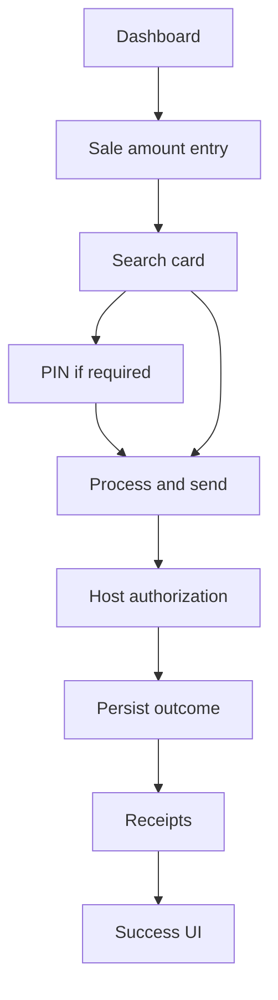

# NextGen POS — portfolio documentation

This repository is **documentation only**. It describes a production-style Android payment terminal application at a **high level**. **Application source is not stored here**; source lives in a separate private project.

**Author:** [shummasniazi](https://github.com/shummasniazi)

---

## What this repo is for

- Public, readable **architecture and flow** notes for reviewers and hiring.
- **No** proprietary URLs, keys, merchant data, or institution names.

---

## Tech stack (summary)

Kotlin, Jetpack Compose, dependency injection, Room, HTTP clients, raw TCP **ISO 8583**, SFTP for file transfer, static analysis and formatting in CI.

---

## Product shape (one module, many variants)

A single application module is built with **Gradle flavors** so one codebase can ship:

- **Two acquirer product lines** (white-label branding and resources).
- **Two OEM terminal stacks** (card reader, printer, EMV lifecycle).
- **Two payment host integrations** (ISO 8583 field layout and transport differ per host flavor).
- **Several environments** (non-production vs production style configuration).

Each build variant selects the appropriate **host field behavior** and **device services** at compile time.

---

## Where to read more

| Topic | Document |
|--------|----------|
| Architecture index | [architecture/README.md](architecture/README.md) |
| Card search and device flavors | [architecture/search-card/CARD_SEARCH_BY_DEVICE.md](architecture/search-card/CARD_SEARCH_BY_DEVICE.md) |
| Sale flow | [architecture/sale/SALE_FLOW.md](architecture/sale/SALE_FLOW.md) |
| ISO 8583 packet building (full) | [architecture/iso8583/PACKET_BUILDING.md](architecture/iso8583/PACKET_BUILDING.md) |
| Data and storage | [architecture/database/DATA_AND_STORAGE.md](architecture/database/DATA_AND_STORAGE.md) |
| Embedded SDK and host callbacks | [architecture/sdk/EMBEDDED_SDK_AND_HOST_CALLBACKS.md](architecture/sdk/EMBEDDED_SDK_AND_HOST_CALLBACKS.md) |

---

## End-to-end sale (one screen-level overview)

---

## Closing

For **card acquisition by OEM**, **sale orchestration**, **ISO fields**, **persistence**, and **SDK embedding**, use the **architecture** links above.
