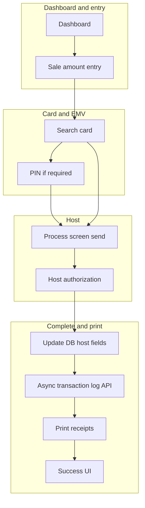
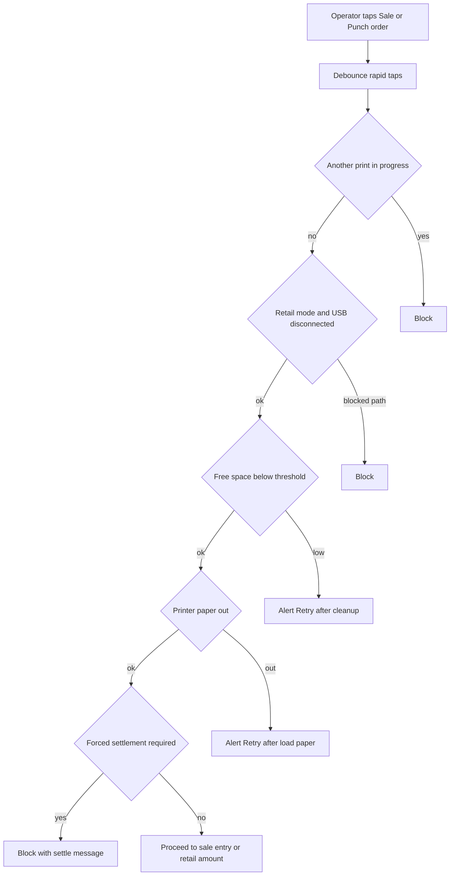
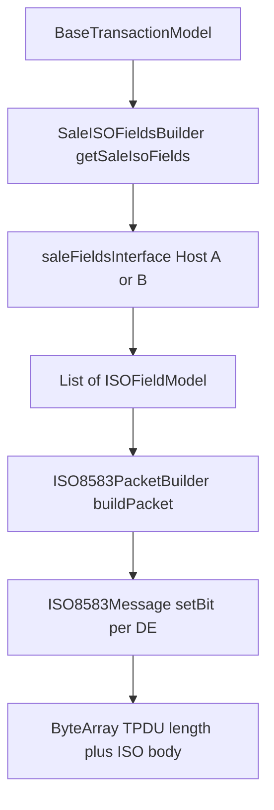
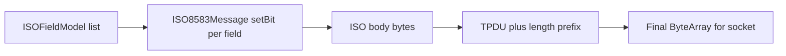
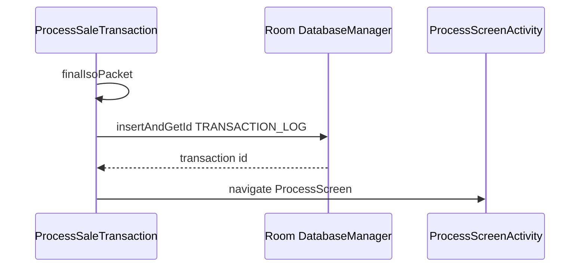
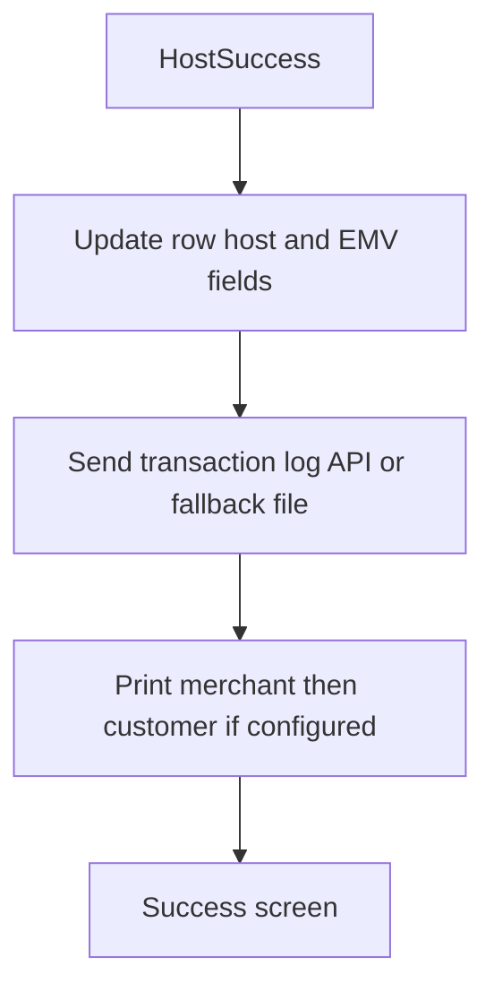

# NextGen POS — Android Payment Terminal Application

**Portfolio / work showcase.** This document describes **NextGen POS** — a production-style Kotlin Android payment terminal application. **Application source is not in this public repository**; paths below use `...` within `app/src/main/java/...` to avoid tying the narrative to internal product or host codenames.

**Author:** [shummasniazi](https://github.com/shummasniazi)

**Neutral glossary (this README only)**

- **Acquirer A / Acquirer B** — Two white-label **client** product lines in Gradle (branding, resources). Not bank names.
- **Host A / Host B** — Two **payment switch** implementations behind the same domain APIs (ISO 8583 field layout and socket behavior differ per host flavor).
- **OEM stack A / OEM B** — Two **device** integrations (card reader, printer, EMV lifecycle).
- **Environment** — Non-production vs production **config endpoints** (Gradle dimension); values are not listed here.

---

## GitHub

This file is the default **`README.md`** on [github.com/shummasniazi/fintech](https://github.com/shummasniazi/fintech). Edit in the private repo and push to `main`, or edit on GitHub.

This README intentionally **does not** embed proprietary URLs, keys, merchant data, or real institution names.

---

## Tech stack (summary)

Kotlin, Jetpack Compose, Hilt, Room, Retrofit, OkHttp, raw TCP **ISO 8583**, JSch SFTP, Detekt, Spotless, Sonar wiring.

---

## Part 1 — Product shape (no host or bank names)

The app is built as **one application module** with Gradle **flavor dimensions** so one codebase ships:

- **Two acquirer product lines** (Acquirer A / B)
- **Two OEM terminal stacks** (OEM A / B)
- **Two payment hosts** (Host A / B)
- **Several environments** (dev / QA / UAT / prod style labels in Gradle)

That yields many **assemble** task combinations; each variant selects the right **host field adapter** and **device service** implementations at compile time.

---

## Part 2 — End-to-end sale flow (user journey)

High-level path from idle terminal to receipt:



---

## Part 3 — Checks before the operator presses **Sale**

These run **before** navigation to the amount / card flow (order is conceptually: debounce, print busy, retail USB, storage, printer paper, then business rules like forced settlement).



**What each gate does (conceptually)**

- **Print in progress** — Global print status prevents overlapping receipt jobs.
- **Retail** — If integrated retail mode expects a USB peripheral, connectivity is checked before continuing.
- **Storage** — Before actions that share the same gate as printing, the app requires **minimum free space** on the internal data partition and on app-scoped external files (so Room writes and log fallbacks are less likely to fail). Implemented in `.../utils/StorageHealth.kt` and invoked from `.../presentation/features/dashboard/viewModel/DashboardViewModel.kt`.
- **Printer paper** — Paper-out sensor path; **Retry** re-checks before continuing (`ReceiptPrintManager` from the dashboard VM).
- **Forced settlement** — Business policy can block new sales until batch settlement (same VM layer as sale click).

**Code anchors (private tree)**

- Dashboard click wiring: `.../presentation/features/dashboard/view/DashboardScreen.kt`
- Debounce, settlement, storage + printer orchestration: `.../presentation/features/dashboard/viewModel/DashboardViewModel.kt`

---

## Part 4 — After amount and card: building the **domain packet** (not wire yet)

When the card flow finishes, `ProcessSaleTransaction.initialize` runs in the sale pipeline:

1. **Allocate** next invoice and STAN from the database helper.
2. **`generateSalePacket`** — Validates EMV / card state from `TransactionHandler`, then builds a `BaseTransactionModel` via `SaleModelCreation` (PAN, amount, dates, entry mode, ICC, track2, PIN block if present, merchant/terminal IDs, NII, private fields, discount and billing-related fields, etc.).
3. **`Validator.validate(saleModel)`** — Internal consistency checks; on failure the flow stops with a terminal-side error path.
4. **`finalIsoPacket`** — See Part 5.

**Code anchors**

- Orchestration: `.../domain/transactions/sale/ProcessSaleTransaction.kt`
- Model factory: `.../domain/transactions/sale/utils/SaleModelCreation.kt`
- In-flight card and amount state: `.../domain/transactions/sale/handlers/TransactionHandler.kt`

---

## Part 5 — **ISO 8583 data elements** used on sale (and how they are built)

Sale requests are assembled in **two steps**: (1) build a `List<ISOFieldModel>` from the in-memory sale row (`SaleISOFieldsBuilder.getSaleIsoFields`), then (2) encode that list into bytes (`ISO8583PacketBuilder.buildPacket`). Each `ISOFieldModel` holds **ISO bit number** (`field`), **payload** (`value` as digits, text, or hex depending on field), **length** passed to the encoder, and optional **`useCustomConversion`** for binary bodies (PIN block, ICC) that are carried as **hex** in the model but measured in **raw byte length** for VAR fields.

### 5.1 — Field inventory (sale request)

The builder follows a **fixed append order**. Rows marked **conditional** are omitted when empty or when the rule fails (the packet builder also skips entries with empty value or non-positive length).

| ISO bit | Typical purpose | Main source on model | Conditional / notes |
|--------:|-----------------|----------------------|------------------------|
| 0 | MTI (financial request) | `de_0_mti` | Always |
| 2 | PAN | `de_2_pan` | Always |
| 3 | Processing code | `de_3_proc_code` | Always |
| 4 | Transaction amount | `de_4_amount` padded to 12 digits | Always |
| 11 | STAN | `de_11_stan` padded to 6 | Always |
| 12 | Local time | `de_12_local_time` | Host adapter may wrap (`getField12LocalTimeFromFlavors`) |
| 13 | Local date | `de_13_local_date` padded | Host adapter may wrap (`getField13LocalDateFromFlavors`) |
| 14 | Expiry | `de_14_expiry_date` | Always |
| 19 | Country code | `de_19_country_code` | Host adapter may wrap |
| 22 | POS entry mode | `de_22_pos_entry_mode` | Always; entry-mode constants often come from `saleFieldsInterface` |
| 23 | PAN sequence number | `de_23_pan_seq_no` | **Only if** non-empty |
| 24 | NII / function code | `de_24_nii_func_code` | Host adapter may wrap |
| 25 | POS condition code | From `SaleType` (normal vs MOTO) via `getConditionCode` | Always |
| 35 | Track 2 | `de_35_track2` | **Only if** non-empty |
| 41 | Terminal ID | `de_41_tid` padded to 8 | Always |
| 42 | Merchant ID | `de_42_mid` padded to 15 | Always |
| 43 | Merchant name | `de_43_merchant_name` | Host adapter may wrap |
| 48 | Additional private data | `de_48_private_data` | Host adapter may wrap |
| 49 | Currency code | `de_49_currency` | Host adapter may wrap |
| 52 | PIN block | `de_52_pin_data` | **Only if** present; hex value, **byte** length, custom conversion |
| 53 | Security-related control data | `de_53_secured_ctrl_data` | **Only if** non-empty; host adapter may wrap |
| 55 | ICC (EMV) data | `de_55_icc_data` | **Only if** present; hex value, **byte** length, custom conversion |
| 60 | Reserved / batch usage | `de_60_reserved` | Host adapter may wrap |
| 62 | Invoice / POS reference | `de_62_invoice_no` | Always in builder list |
| 120 | Network private | `de_120_reserved_private_data` | Host adapter may wrap |
| 121 | Tip amount | From `if_tip` | **Only if** tip parses to a positive amount |
| 122 | Batch number | From `de_batch_no` | **Only if** tip branch entered (same guard as DE121 in current code) |

Bit index constants (`FIELD_MTI`, `FIELD_PAN`, …) live in `.../domain/transactions/sale/constants/SaleConstants.kt`. **Semantic defaults** for MTI, processing code, currency, reserved tokens, and MOTO POS condition come from sale constants and `SaleModelCreation`; low-level formatting differences stay in **Host A / B** `saleFieldsInterface` implementations.

### 5.2 — How values are **formed** before ISO encoding

- **DE4 amount** — Business amount is converted to ISO amount form and **left-padded with zeros** to 12 characters.
- **DE11 STAN** — Left-padded to 6 digits from the counter allocated in `ProcessSaleTransaction.initialize`.
- **DE12 / DE13** — Taken from the terminal timestamp at model creation; host flavors may reformat width or encoding.
- **DE22** — Reflects chip, contactless, mag-stripe, or keyed (MOTO) capture path from `TransactionHandler` / card stack.
- **DE25** — `saleFieldsInterface.getConditionCode` distinguishes normal sale vs MOTO sale using `TransactionManager.transactionType`.
- **DE35** — Included only when track-2 data exists.
- **DE52 / DE55** — Binary fields: bytes → **hex** in `ISOFieldModel.value`, with `length` = **byte count** and `useCustomConversion = true` so `ISO8583PacketBuilder` uses `ConversionUtils.stringToByteArray` correctly for TLV/BCD packing.
- **DE121 / DE122** — Appended only when tip is non-zero; values are padded numeric strings per builder.

### 5.3 — How the **list** becomes **on-wire bytes** (ties to Part 6)

For each retained `ISOFieldModel`, `ISO8583Message.setBit(field, data, len)` uses **`ISO8583DomainConfig`** for that bit: max length, **fixed vs variable** length (`ISO8583LengthType`), and encoding type (`ISO8583EncodingType`, e.g. BCD vs ASCII). Bit **0** carries the MTI; bits **2+** set the bitmap and write field bodies into an internal buffer. Fields that were never added do not appear in the bitmap.

Then **`ISO8583PacketBuilder.getPacketHeader`** prepends **BCD length** and **TPDU** (`TPDU.get()`), producing the final `ByteArray` stored on the transaction row and sent on the socket.

### 5.4 — Why **Host A / Host B** matter at the field-list stage

**`saleFieldsInterface`** supplies host-specific `ISOFieldModel` wrappers for many DEs (time, date, country, NII, track 2, merchant name, 48, 49, 53, 60, 120, tip/batch helpers). The same orchestration code therefore emits **different** field packaging per host without duplicating `SaleISOFieldsBuilder` control flow.

**Code anchors**

- Field list and conditionals: `.../domain/transactions/sale/utils/SaleISOFieldsBuilder.kt`
- Bit indices and defaults: `.../domain/transactions/sale/constants/SaleConstants.kt`
- Model population: `.../domain/transactions/sale/utils/SaleModelCreation.kt`
- Host interface: `.../flavors/interfaces/` (host-specific implementations)
- Bitmap / encoding: `.../services/iso8583/packetBuilder/ISO8583Message.kt`, `.../services/iso8583/domain/ISO8583DomainConfig.kt`



---

## Part 6 — How the **binary ISO packet** is produced

1. **`ISO8583PacketBuilder.buildPacket`** walks each `ISOFieldModel`. Non-empty fields with positive length are written into an `ISO8583Message` bit map using per-field length and optional hex/binary conversion flags.
2. **`getPacketHeader`** prepends a **length prefix** and **TPDU** header bytes to the ISO body so the raw socket layer sends a single framed message.

**Code anchors**

- `.../services/iso8583/packetBuilder/ISO8583PacketBuilder.kt`
- `.../services/iso8583/packetBuilder/ISO8583Message.kt`



---

## Part 7 — **Persisting** the sale in Room **before** the host responds

After `finalIsoPacket()`:

- `insertTransactionLogWithReadyToSendStatus` maps the model to a `TransactionLogEntity`, adds logger columns (`if_transaction_guid`, `if_transaction_logged`, etc.), and **`insertAndGetId`** into the `TRANSACTION_LOG` table.
- Status is **ReadyToSend**; the serialized ISO bytes live in the row for audit and retransmit patterns.
- On success the UI navigates to the **process** screen, which drives the socket send and host wait.



**Code anchors**

- Insert and status: `.../domain/transactions/sale/ProcessSaleTransaction.kt` (`insertTransactionLogWithReadyToSendStatus`, `initialize`)

---

## Part 8 — **Online** phase: send, update status, interpret host reply

After insert, the process screen sends the byte array over TCP, then:

- Updates **SentToHost** and persists STAN-related fields via callbacks registered in `setupAfterSendCallback`.
- Parses the host response into a `SocketResponse` (RRN, auth code, response code, host date/time, optional ICC payload).
- **Success path** (response code rules include an optional certification mode for EMV testing): updates model to **HostSuccess**, hands off to completion.
- **Failure path** — Reversal / error UI depending on policy.

**Code anchors**

- `.../domain/transactions/sale/ProcessSaleTransaction.kt` (`handleSaleSuccess`, `afterSendMethodSale`)
- `.../remote/socket/` (socket client and response parsing)

---

## Part 9 — **Completing** the sale: DB merge, logging, **printing**

`CompleteSaleTransaction` coordinates post-host work:

- **Persist host fields** — Updates the same `TRANSACTION_LOG` row with response time/date, DE39, RRN, auth code, EMV TVR/TSI if updated, QR/barcode value, billing columns when enabled, etc.
- **Transaction logger** — Asynchronous REST call with timeout; on failure the app appends an **encrypted JSON line** to a local fallback file (rolled by record count), uploaded later over SFTP during settlement. See `.../remote/network/repositories/DataLoggerRepository.kt` and `.../services/fileLoggingService/FileLoggingService.kt` and internal doc `docs/TransactionLogging.md` in the private repo.
- **Printing** — Merchant/customer receipt generation through the print stack for the active **OEM** integration; print state transitions (e.g. in progress / success) are written back to the transaction row.



**Code anchors**

- `.../domain/transactions/sale/CompleteSaleTransaction.kt`
- Printing managers under `.../printing/` and OEM-specific implementations under OEM-flavored source sets

---

## Part 10 — **DMS**, **settlement SFTP**, **crash**, **SDK** (short pointers)

- **Discount / DMS** — Update API; on failure a **CSV line** is appended under app external files for later SFTP (`.../presentation/features/dms/service/DMSService.kt` plus file service above).
- **Settlement** — Batch close and reporting; also triggers ordered **SFTP upload** of pending discount and logger fallback files before follow-up UI (`.../domain/transactions/settlement/helpers/SettlementHelper.kt`).
- **Crash** — Encrypted external log with internal-storage fallback (`.../presentation/features/crashScreen/crashHandler/CrashHandler.kt`).
- **Embeddable SDK** — Same activities invoked from a host app: pay, keyed pay, void, settle, print, configure, settings, logon, history (`.../sdk/SdkManager.kt`, `.../sdk/SdkManagerImp.kt`). Low-storage guard applies on SDK entry paths as well.

---

## Part 11 — Build and quality (commands only)

```bash
./gradlew :app:assemble<Acquirer><OEM><Host><Env>Debug
```

APKs appear under `app/build/outputs/apk/<variant>/debug/` with a generated filename pattern from Gradle.

Quality tooling: Spotless, Detekt, Sonar properties in `app/build.gradle.kts`.

---

## Part 12 — Further reading (files exist only in the private repo)

- Transaction logging and SFTP: `docs/TransactionLogging.md`
- TMS / app update: `docs/TMS_APP_UPDATE_FLOW.md`
- MOTO: `docs/MOTO_SALE_DOCUMENTATION.md` and related MOTO docs
- SDK JSON: `docs/SDK_RESPONSES_README.md`
- Obfuscation: `docs/OBFUSCATION_GUIDE.md`, `docs/OBFUSCATION_SUMMARY.md`
- Code quality: `docs/code_quality.md`
- High-level map: `skill.md`

---

## Closing

This README is a **structured portfolio narrative** focused on **sale flow**, **preconditions**, **ISO construction**, **persistence**, and **completion**. For exact field matrices per host, see the private repository’s host-specific `SaleFields` implementations and internal integration documents.
