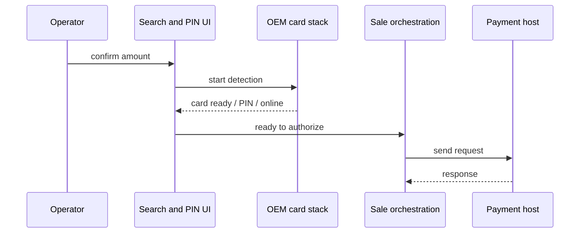

# Sale flow (structure)

This page summarizes how a **card-present sale** moves through the product from operator intent to a settled outcome, without naming implementation artifacts.

---

## 1. Entry and preconditions

Before the operator reaches amount entry or card search, the dashboard layer applies **gates**: rapid-tap debouncing, whether another print is in progress, optional retail USB connectivity, **minimum free storage**, printer paper, and business rules such as **forced settlement**. Failures surface as toasts or dialogs with retry paths where appropriate.

---

## 2. Amount and transaction type

The operator enters the sale amount (and may select transaction type, tips, or retail-specific entry depending on configuration). In-memory **transaction context** holds amount, currency, MOTO vs card-present flags, and other fields that downstream steps consume.

---

## 3. Card search and EMV

The **search card** surface discovers the card (mag, chip, or contactless), collects PIN when required, handles CDCVM and contactless policy where applicable, and eventually signals that the application should **build the authorization request** and continue online. OEM-specific behavior is described in **Card search and device flavors**.

---

## 4. Domain model and validation

When authorization is requested, the orchestration layer allocates identifiers (invoice, trace number), builds a **normalized sale model** from the transaction context (PAN, amounts, dates, entry mode, EMV blobs, optional PIN block, merchant and terminal identifiers, private fields per host rules), and runs **internal validation**. Failure stops before any wire-format message is produced.

---

## 5. ISO message assembly and persistence

The normalized model is turned into a **field list** (bit numbers, values, lengths, and special handling for binary bodies such as PIN and ICC). A second stage turns that list into **framed binary** suitable for the socket layer (bitmap, per-field encoding, length prefix and routing header as required by the integration).

A **transaction log row** is inserted in a **ready-to-send** state so every attempt has a durable id; the UI then moves to the **process** phase that owns the actual send and host wait.

---

## 6. Online phase

The process phase sends the payload over TCP (or TLS where configured), updates status to **sent**, parses the host reply (response code, retrieval reference, authorization code, timestamps, optional EMV payload), and chooses success, decline, or error handling including reversal policy where applicable.

---

## 7. Completion

On success, a **completion** coordinator updates the log row with host and EMV fields, triggers **transaction logging** (API with local encrypted fallback and later file upload where configured), and drives **receipt printing** for merchant and customer copies. The UI ends on a success screen; decline and error paths update state and messaging accordingly.

---

## 8. Related topics

- **ISO 8583** — field list and encoding stages.
- **Data and storage** — how the log row and dynamic queries fit in.
- **Embedded SDK** — same flow when launched from a host app.
