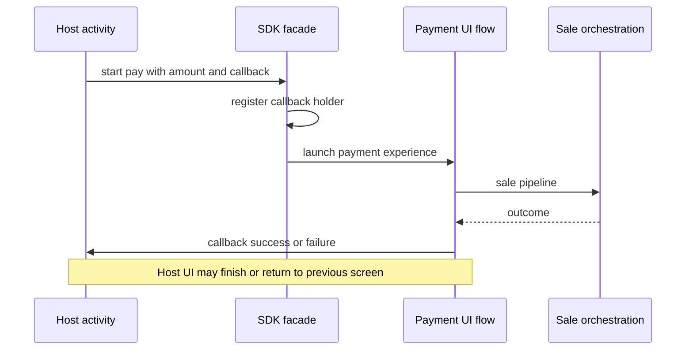

# Embedded SDK and host callbacks (structure)

The payment module can run **inside a host application** (merchant POS, bank wrapper, kiosk shell). Host apps need a narrow contract: start a payment, optionally other operations (void, settlement, history), and receive **success** or **failure** on the way out.

---

## Entry

The SDK facade validates that the host passed a suitable **activity context**, that local **merchant configuration** is present, and may apply the same **storage gate** as the standalone app so failures happen before navigation. Optional flows (tip before card) chain into the same **search card** experience used in standalone mode.

---

## Callback contract (conceptual)

The host supplies a **callback** with two outcomes:

- **Success** — A string payload describing the transaction outcome (often JSON-shaped for machine parsing by the host).
- **Failure** — A single human-readable message (user cancel, validation, network, low storage, and similar).

A small **holder** object keeps the active callback for the duration of the payment activity so completion handlers can invoke it when the payment stack finishes.

---

## Flow

---

## Threading and UX

Low-storage and configuration failures are surfaced on the **UI thread** so the host can show toasts or dialogs safely. The SDK is responsible for not leaking long-lived references to destroyed host activities where the integration uses weak patterns or explicit clearing on exit.

---

## Relationship to card search

From the SDK entry point, the user lands in the same **search card** and **PIN** surfaces as standalone mode; OEM behavior is unchanged. See **Card search and device flavors** for how Sunmi vs Topwise acquisition fits underneath.

---

## Related topics

- **Sale flow** — what runs after the SDK hands off to the internal payment stack.
- **Data and storage** — how transaction rows relate to SDK-driven sessions.
