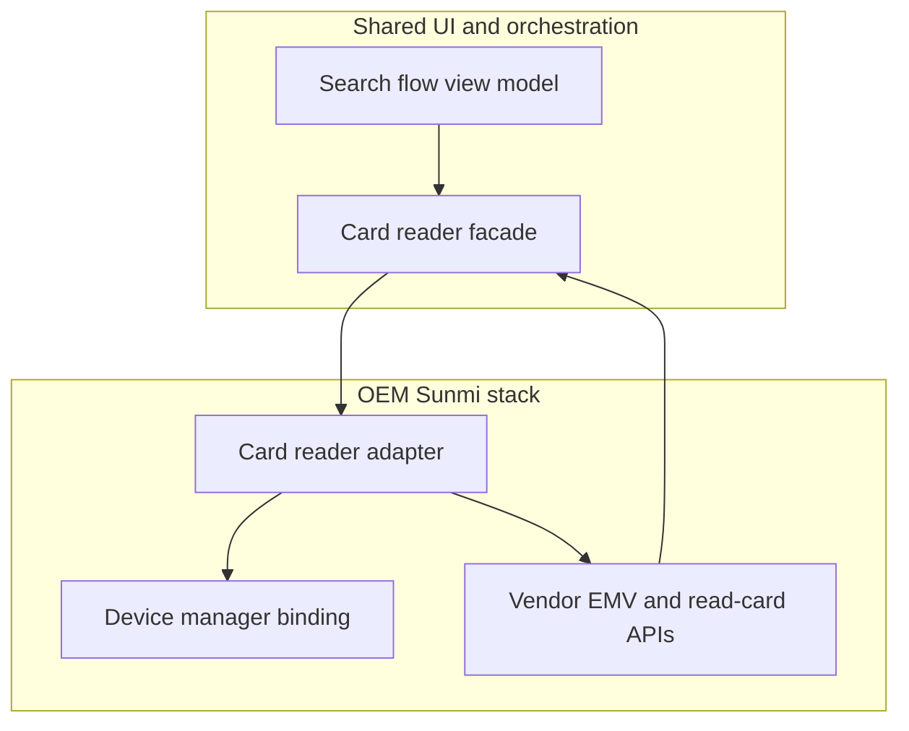
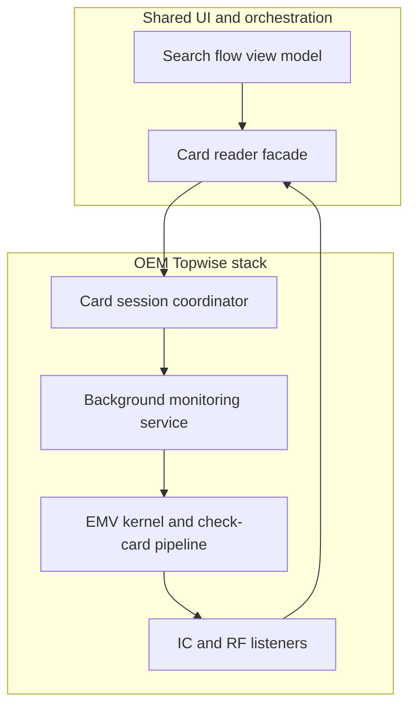

# Card search and device flavors

The **search card** experience is shared in the product: one flow for amount confirmation, card discovery, PIN when required, and handoff to online processing. **How the terminal actually talks to the card** depends on which **OEM** the build targets. The product ships two major OEM paths; below they are referred to as **OEM Sunmi** and **OEM Topwise**.

---

## Shared layer (conceptual)

- A **card reader facade** sits in front of the UI. The UI registers for a small set of outcomes: card ready, move to PIN, request online authorization, terminal or user errors, timeouts, and contactless-specific cases (for example limit exceeded or fall back to chip).
- A **search / EMV helper** layer handles lifecycle: starting and stopping detection, resetting PIN and CDCVM-related state, attaching online callbacks, and copying normalized card data into the transaction context used later for authorization.
- **Device services** (initialization, PIN pad, starting card read) are OEM-specific implementations selected at compile time together with the card stack.

---

## OEM Sunmi path (structure)

**Narrative**

1. Initialization waits until the vendor device layer is ready, then wires the same **event contract** the UI uses into the vendor card reader component.
2. The Sunmi-side adapter registers that contract on the vendor reader, then starts **check card** for mag stripe, contactless, and chip in an order defined by the vendor integration.
3. The vendor path drives EMV steps through internal handlers; outcomes surface back through the shared **event contract** (confirm card, PIN, online, result, errors).
4. When the sale moves to authorization, the search helper **extracts** PAN, track data, EMV containers, and related fields from the vendor reader state into the in-memory **transaction context** used by the sale pipeline.

**Characteristics:** Tight coupling to the vendor’s in-process APIs; a single callback object often bridges vendor callbacks and the shared facade.

---

## OEM Topwise path (structure)

**Narrative**

1. The Topwise-side adapter resets PIN-related flags, registers **exception** callbacks (timeout, cancel, generic errors, contactless limit), and attaches **IC** and **RF** listeners that forward into the EMV kernel.
2. A **card deal** entry point starts a **background service** that polls the device stack unless the transaction is explicitly keyed (MOTO), in which case card detection is skipped.
3. The service binds to the device service, runs **check card** across mag, chip, and contactless, and routes discovery into chip or contactless start paths.
4. Events are posted to the main thread and mapped onto the same **event contract** the shared facade exposes to the UI.
5. **Extract for authorization** reads kernel and coordinator state into the same **transaction context** model as on Sunmi so the rest of the sale pipeline stays identical.

**Characteristics:** More moving parts (service + coordinator + listeners); richer **exception** surface for contactless limits and user cancellation.

---

## Flavor selection (conceptual)

At **compile time**, the build picks **one** OEM implementation for device service and **one** card reader implementation behind the facade. The UI and sale logic do not branch on OEM string at runtime; they depend on the shared contracts and normalized transaction context.

---

## Related topics

- **Sale flow** — when search hands off to authorization and printing.
- **Embedded SDK** — when search is launched from a host application instead of the standalone shell.

See the sibling pages under this **architecture** folder.
