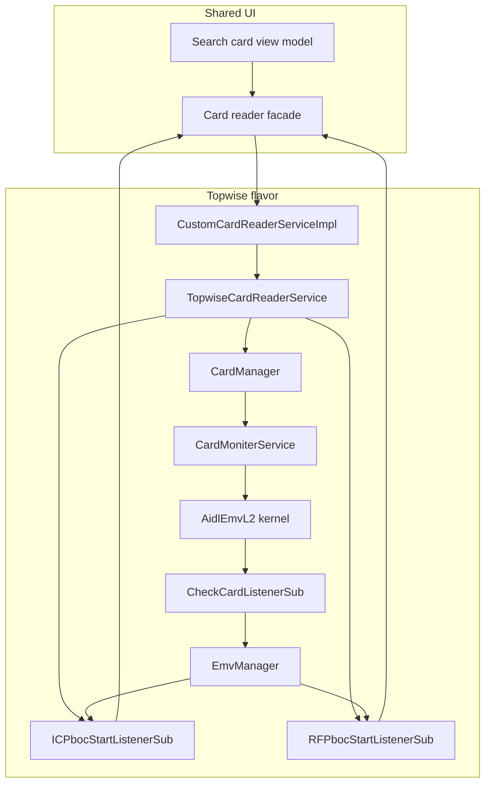
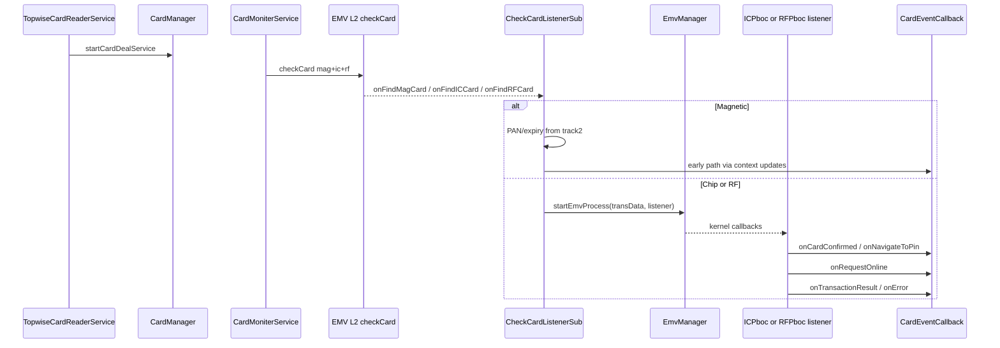
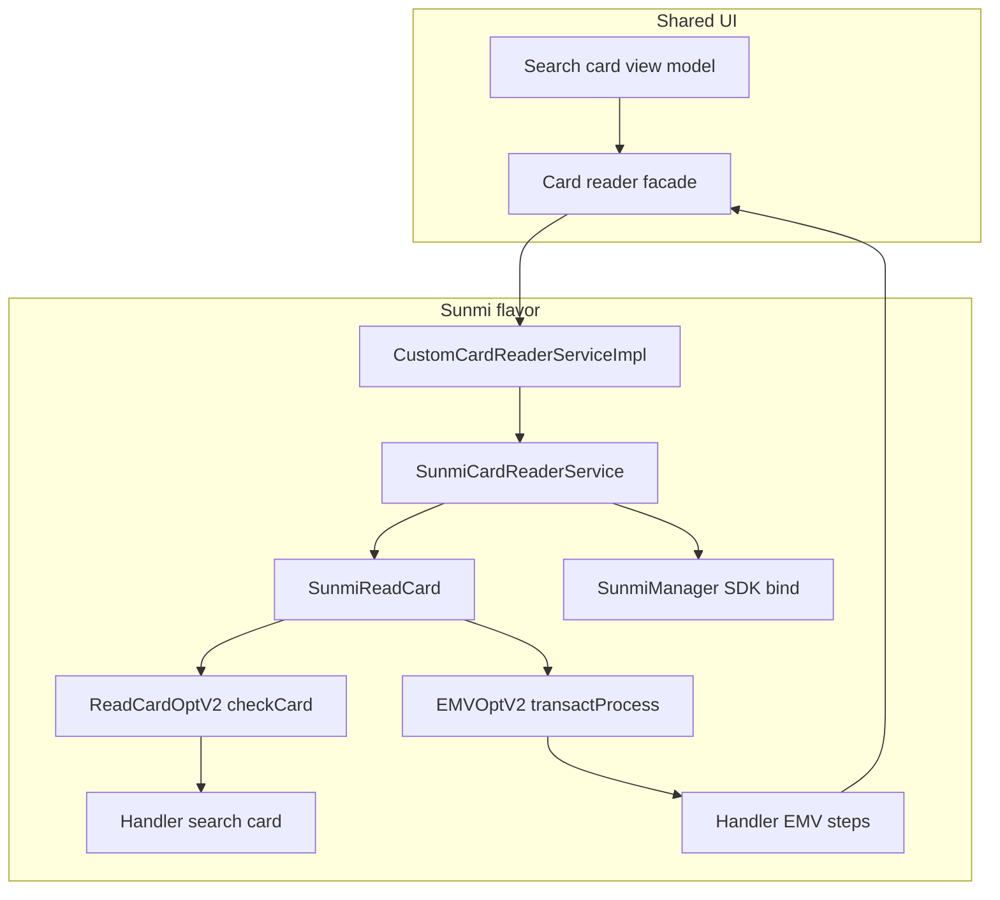
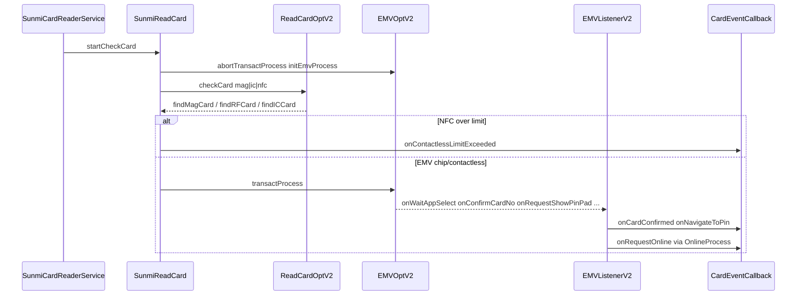

# Search card — Topwise vs Sunmi (complete flow)

This document traces **every flavor-specific class** involved in **search card** and **EMV**, then explains how data reaches the shared sale pipeline. Diagrams use **Mermaid**.

---

## Shared concepts (both flavors)

| Concept | Meaning |
|--------|---------|
| **Search card UI** | Operator-facing screen; talks to a **device service** and a **card reader facade** through the same high-level **card event** contract (card confirmed, PIN, online, errors, timeout, cancel, contactless limit, “insert card”). |
| **Transaction context** | In-memory state (PAN, track2, expiry, AID, ICC tags, PIN, CVM flags, CDCVM, amounts) used when building ISO and persisting the log. |
| **EMV** | Card and terminal run a **kernel** protocol: application selection, risk management, PIN verification (offline on card / online at host), **first/second GENERATE AC**, then **online authorization** with optional **DE55** TLVs. |
| **CVM (Cardholder Verification Method)** | Rules from the card (e.g. tag **8E**) and scheme policy determine whether **PIN**, **signature**, **CDCVM** (device verification on phone/watch), or **no CVM** applies. |
| **CDCVM** | Contactless flow where the card expects the **consumer device** to have been verified; the app may trigger a **second tap** or device-check path when the kernel returns specific **result / error codes** (implementation differs slightly between flavors but the intent is the same). |
| **Contactless limit** | If transaction amount exceeds a configured **contactless ceiling**, the terminal stops RF and asks the user to **insert or swipe** (chip/mag) so the higher CVM requirements can be met. |

---

## Class inventory — Topwise (`app/src/topwise/...`)

| Class | Responsibility |
|-------|----------------|
| **`CustomCardReaderServiceImpl`** | Flavor entry: creates **`TopwiseCardReaderService`**, maps **`TopwiseCardReaderService.CardEventCallback`** onto the main module’s **`CardReaderService.CardEventCallback`**. |
| **`TopwiseCardReaderService`** | Orchestrates Topwise stack: resets PIN flags, registers **`CardManager.CardExceptionCallback`**, registers **RF** (`RFPbocStartListenerSub`) and **IC** (`ICPbocStartListenerSub`) **`CardEventListener`** implementations, starts **`CardManager.startCardDealService`**, stops service on cleanup. |
| **`CardManager`** | Singleton hub: **PIN attempt state** (attempted PIN, buffered transaction result, retry count), **`CardResultCallback`** / **`CardExceptionCallback`** to EMV listeners, **`startCardDealService`** / **`stopCardDealService`**, **`notifyEarlyCardDetection`**, listener instances (**IC** / **RF**), **MOTO** early exit (no card detection). |
| **`CardMoniterService`** | Android **`Service`**: obtains **`AidlEmvL2`**, ends prior EMV if needed, calls **`checkCard(mag, ic, rf, timeout)`** with **`CheckCardListenerSub`**, propagates errors / contactless limit to **`CardManager`**, **`cancelCheckCard`** on destroy. |
| **`CheckCardListenerSub`** | **`AidlCheckCardListener`**: **mag** → parse track2 PAN/expiry, update context, cancel check; **IC** → early detection, set input mode IC, build **`EmvTransData`**, **`EmvManager.startEmvProcess`** with **`ICPbocStartListenerSub`**; **RF** → contactless limit check, cleanup listeners, early detection, set RF mode, **`RFPbocStartListenerSub`**. |
| **`EmvManager`** | Wraps Topwise **L2 EMV** API: **`startEmvProcess`**, **`importPin`**, **`importAmount`**, **`importAidSelectRes`**, **`importOnlineResp`**, **`importUserAuthRes`**, **`readKernelData`**, **`endEMV`**, etc. |
| **`ICPbocStartListenerSub`** | **`OnEmvProcessListener`** for **chip**: wires **`CardManager.initCardResultCallback`** (PIN, amount, AID, confirm, user auth, online response into kernel), handles **`requestImportPin`** (offline vs online type, duplicate guards, **`onNavigateToPin`**), **`onRequestOnline`** (populate TVR/TSI/track2/55/AID/labels, CDCVM flag, optional PIN gate, **`onRequestOnline`** to UI), **`onTransResult`** (rejections, PIN failure, CDCVM second read, **`endEMV`**), kernel TLV reads. |
| **`RFPbocStartListenerSub`** | **`OnEmvProcessListener`** for **contactless**: same **`CardResultCallback`** pattern; **`onConfirmCardInfo`** (PAN, early CDCVM check); **`requestImportPin`** with expiry guard; **`onRequestOnline`** with **VEPS/CLCVM** style rules by association (Visa/Mastercard/UnionPay/PayPak), **CDCVM** short-circuit (no PIN); **`onTransResult`** with **buffered result + PIN** path, **`isCdcvmScenario`**, association-based PIN requirement; **`onError`** CDCVM handling. |
| **`SearchCardInterfaceImp` (Topwise)** | **`startCardReadingService`** → **`CardManager.startCardDealService`**; clears listeners; **`endEmv`** / **`endEmvWithSleep`**; PIN flags via **`CardManager`**; **`isEmvSessionEnding`** from IC listener; **`extractCardDataForProcessing`** intentionally empty (kernel data already on **`TransactionHandler`** from listeners). |

---

## Topwise — end-to-end flow (diagram)

**EMV details (Topwise)**

1. **Card detection** — Single **`checkCard`** with timeout (~60s in service). Errors/timeouts/cancel flow to **`CardManager`** exception callback → UI.
2. **Mag** — No full EMV kernel path in listener; track2 drives PAN/expiry.
3. **Chip** — **`ICPbocStartListenerSub`** receives **`requestImportAmount`**, **`requestImportPin`** (types 1/2 offline, 3 online per vendor), **`onRequestOnline`** after reading **95 / 9B / 57 / 5A / 5F34 / 9F26 / 9F27 / 9F10** etc. into **`TransactionHandler`**, **`finalAidSelect`**, **`requestAidSelect`** (multi-AID / PayPak rules), **`onTransResult`** with PIN failure handling and **`endEMV`**.
4. **RF** — **`RFPbocStartListenerSub`** adds **contactless limit** before EMV; **CDCVM** sets **`isCdcvmFlow`** and may call **`onDeviceCheckFailed`** to drive second tap; **CVMValidationUtils** for scheme-specific PIN waiver; **`onTransResult`** can **buffer** result until PIN is imported via **`CardManager`** then continue.
5. **PIN path** — User PIN goes **`CardManager.setImportPin`** → **`emvManager.importPin`**. Centralized **`PinAttemptState`** avoids duplicate PIN screens.
6. **Online** — Host response is fed back with **`importOnlineResp`** when the sale pipeline completes the network round-trip (wired through **`CardResultCallback.requestOnline`** from process layer).

---

## Class inventory — Sunmi (`app/src/sunmi/...`)

| Class / file | Responsibility |
|--------------|----------------|
| **`CustomCardReaderServiceImpl`** | Creates **`SunmiCardReaderService`**, forwards **`CardReaderService.CardEventCallback`**. |
| **`SunmiCardReaderService`** | Waits for **`SunmiManager`** bind, sets **`CommonUtil`** activity, **`SunmiReadCard.setCallback`**, **`startCheckCard`**; **`abortCheckCard`** / cleanup; internal forwards to callback on main thread. |
| **`SunmiReadCard`** (Java) | Holds **`EMVOptV2`**, **`ReadCardOptV2`**, **`TradeData`**, **`PayDetail`**; **`startCheckCard`**: **`abortTransactProcess`**, **`initEmvProcess`**, **`checkCard`** (mag | IC | NFC or device-constrained modes); **`CheckCardCallbackV2`** posts **mag / NFC / IC** to **`Handler`**; large **`EMVListenerV2`** for kernel steps; second **`Handler`** for EMV_APP_SELECT, **ONLINE**, errors, offline approval; static **`sCallback`** = shared **`CardEventCallback`**; **`getCurrentPayDetail` / `getCurrentTradeData`** for **`SearchCardInterfaceImp`**. |
| **`SunmiManager` / `CommonUtil` / `EmvHelper` / `OnlineProcess` / `OfflineProcess`** | SDK binding, activity context, EMV helper imports (risk, app final select, PIN status, signatures), online TLV build, offline approval. |
| **`SearchCardInterfaceImp` (Sunmi)** | **`startCardReadingService`** → **`deviceService.startCardReading`**; **`extractCardDataForProcessing`** copies **`PayDetail`** + card mode into **`TransactionHandler`** (PAN, AID, TVR, TSI, TC, AC, track2, **ICC hex → bytes**, etc.); **`clearPinEntryInProgressFlag`** → **`SunmiReadCard`**. |

Supporting Sunmi types (card / EMV): **`PayDetail`**, **`TradeData`**, **`EmvUtil`**, **`KernelDataProcessUtil`**, **`TLV` / `TLVUtil`**, **`CardType`**, **`EMVController`** (if referenced), **`ValidationHelper`**, etc., are used inside **`SunmiReadCard`** and helpers for TLV, limits, and kernel data.

---

## Sunmi — end-to-end flow (diagram)

**EMV details (Sunmi)**

1. **Initialization** — **`startCheckCard`** always resets transaction EMV state (**`abortTransactProcess`**, **`initEmvProcess`**) to avoid stale callbacks; optional **ignore stale** window around abort.
2. **Card detect** — **`ReadCardOptV2.checkCard`**: combined mag+IC+NFC, or **NFC-only** / **IC-only** device profiles. NFC applies **contactless limit** (same idea as Topwise); on exceed, **`cardOff`**, restrict next check to **mag+IC**, **`onContactlessLimitExceeded`**.
3. **Handlers** — Search **`Handler`** dispatches **mag** (`handleMagCard`), **NFC** (`handleNFCCard`), **IC** (`handleICCard`); EMV **`Handler`** runs **app select UI**, **final select import**, **cert**, **signature**, **online** branch (**`OnlineProcess.onlineProcess`** builds request TLVs / calls **`onRequestOnline`** on callback), **offline approval**, **errors**.
4. **`EMVListenerV2`** — Implements kernel hooks: **`onTermRiskManagement`**, **`onPreFirstGenAC`**, **`onDataStorageProc`**, **`onWaitAppSelect`** (PayPass preference **A0000000041010**, PayPak **A000000736**, UnionPay multi-app dialog **A000000333**, skip Maestro **A0000000046000**), **`onAppFinalSelect`** (sets association / PayPak RF flag), **`onConfirmCardNo`**, **`onRequestShowPinPad`** (offline retry, **CVM list 8E** override type 0→offline when card supports it, **CDCVM** skip PIN via **`EmvHelper.importPinInputStatus`**, **VEPS/CLCVM** for RF like Topwise), **`onOnlineProc`** / online result handling, error paths.
5. **PIN** — Static flags **`sPinEntryInProgress`**, **`sPinEntryCompleted`**, **`sOnlineProcReceived`** coordinate SDK vs app PIN ordering; **`OfflinePinRetryCoordinator`** for Sunmi offline retry UX.
6. **Data extraction for sale** — **`SearchCardInterfaceImp.extractCardDataForProcessing`** reads **`SunmiReadCard.getCurrentPayDetail()`** into **`TransactionHandler`** including **hex ICC → byte array** for **DE55**.

---

## Side-by-side comparison

| Aspect | Topwise | Sunmi |
|--------|---------|-------|
| **Process model** | Foreground **`Service`** + **`AidlEmvL2.checkCard`** | In-process **`ReadCardOptV2.checkCard`** |
| **EMV entry** | **`EmvManager.startEmvProcess`** after find IC/RF | **`EMVOptV2.transactProcess`** after handler routes chip/NFC |
| **Listeners** | Two Kotlin classes (**IC** / **RF**) implementing **`OnEmvProcessListener`** | One large **`EMVListenerV2.Stub`** in Java + two Handlers |
| **Exception surface** | **`CardExceptionCallback`** on **`CardManager`** | Mix of **`onError`** on check card, **`EMV_ERROR`** handler, **`onCardError`** callback |
| **Contactless limit** | **`CheckCardListenerSub`** before RF EMV | **`findRFCard`** before posting NFC handler |
| **CDCVM** | **`RFPbocStartListenerSub`** / **`onError`**, **`onTransResult`** | **`EMVListenerV2`** + **`EMV_ONLINE_PROCESS`** handler with **`isCdcvmFlow`** |
| **MOTO** | **`CardManager.startCardDealService`** returns immediately | Not shown in Sunmi path here; keyed flows bypass physical search elsewhere |
| **Extract for ISO** | Kernel fills **`TransactionHandler`** during **`onRequestOnline`** path; **`extractCardDataForProcessing`** no-op | Explicit **`PayDetail`** → **`TransactionHandler`** in **`SearchCardInterfaceImp`** |

---

## EMV tag reference (what the flows populate for authorization)

Typical tags mirrored into context or **DE55** (not exhaustive; depends on kernel and card):

| Tag | Role |
|-----|------|
| **9F26** | Application Cryptogram (AC) |
| **9F27** | Cryptogram Information Data (CID) |
| **9F10** | Issuer Application Data (IAD) |
| **9F36** | Application Transaction Counter (ATC) |
| **9F37** | Unpredictable Number |
| **95** | TVR — Terminal Verification Results |
| **9B** | TSI — Transaction Status Information |
| **9F02** | Amount, authorised |
| **5F2A** | Transaction currency code |
| **82** | AIP |
| **84** | Dedicated file name |
| **4F** | ICC AID |
| **9F06** | AID (terminal) |
| **57** | Track 2 equivalent data |
| **5A** | PAN |
| **5F34** | PAN sequence number |
| **8E** | CVM List |
| **91** | Issuer Authentication Data (second GEN AC) |

---

## Cleanup and restart

- **Topwise:** **`TopwiseCardReaderService.cleanup`** → **`stopCardDealService`**, **`CardManager.clearCurrentListeners`**, resets PIN flags. **`SearchCardInterfaceImp`** may call **`endEMV`** on timeout.
- **Sunmi:** **`abortCheckCard`**, **`cleanup`** clears activity reference; **`completeCleanup`** nulls reader and callback.

---

## How this connects to the rest of the app (shared)

The main module’s **`CardReaderService`** builds the flavor **`CustomCardReaderServiceImpl`**. **`SearchCardViewModel`** uses **`DeviceServiceInterface`** to initialize hardware and **`SearchCardInterface`** for **`extractCardDataForProcessing`** before **`ProcessSaleTransaction`**. Once **`onRequestOnline`** fires, the **same** sale and ISO pipeline runs regardless of OEM.

For more on **ISO 8583** after card data is ready, see **`docs/architecture/iso8583/PACKET_BUILDING.md`**.
